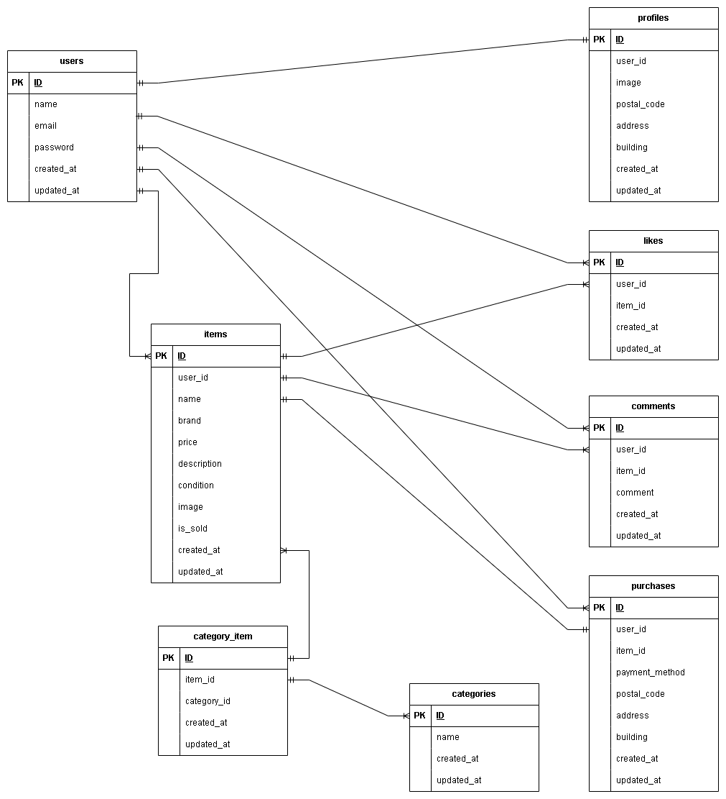

# 模擬案件初級_フリマアプリ

---

## 環境構築

### Dockerビルド

1. git clone git@github.com:hiroshi-tak/mogi1-form.git
2. docker-compose up -d --build

### Laravel環境構築

1. docker-compose exec php bash
2. composer install
3. cp .env.example .env
   * DB_HOST=mysql
   * DB_DATABASE=laravel_db
   * DB_USERNAME=laravel_user
   * DB_PASSWORD=laravel_pass
   * MAIL_FROM_ADDRESS=test@example.com
   * MAILHOG_URL=http://localhost:8025
   * STRIPE_KEY,STRIPE_SECRET設定
4. php artisan key:generate
5. php artisan migrate
6. php artisan db:seed
7. php artisan storage:link
8. cp .env .env.testing
   * APP_ENV=testing
   * APP_KEY=
   * DB_DATABASE=demo_test
   * DB_USERNAME=root
   * DB_PASSWORD=root
   * MAIL_MAILER=log
   * MAIL_FROM_ADDRESS=test@example.com
   * MAIL_FROM_NAME="Test"
9. mysql -u root -p
10. CREATE DATABASE demo_test;
11. php artisan key:generate --env=testing
12. php artisan config:clear
13. php artisan migrate --env=testing

### ユーザー登録について
ユーザーは2人登録
* 一人目  10商品出品
  * ユーザー名	：Taro Yamada
  * email		: taro@example.com
  * password		: 12345678
* 二人目  0商品出品(出品なし)
  * ユーザー名	：Jiro Yamada
  * email		: jiro@example.com
  * password		: 12345678

## テスト実行
1. php artisan config:clear
2. php artisan cache:clear
3. php artisan test

## 開発環境

- 商品一覧画面:http://localhost/
- 会員登録:http://localhost/register
- phpMyAdmin:http://localhost:8080/
- MailHog:http://localhost:8025/

## 使用技術

- PHP 8.1.34
- Laravel 8.83.8
- GD 2.3.3
- MySQL 8.0.26
- nginx 1.21.1

## ER図

